# Esp32_debug_template
This is a template project for debugging esp-idf projects on VsCode

If you are looking for ESP32 Arduino debugging, check out PlatformIO or VisualGDB.

### Feel free to use this template as a base for new esp-idf projects

## Get the tools ##
1. Install git from https://git-scm.com/download/win
2. Clone the esp-idf v3.2 branch using command:  
 `git clone --recursive -b release/v3.2 https://github.com/espressif/esp-idf.git`
3. Add IDF_PATH and path to esp-idf\tools to system "path" environment variables:

- Right click on "This PC" -> Properties    

    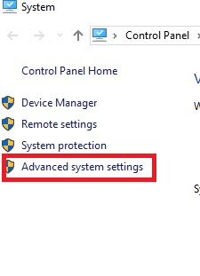 
- Go to "Advanced System Settings"  

    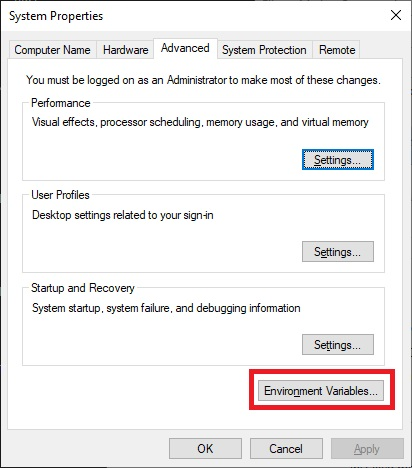  
- Add a new environment variable called `IDF_PATH` pointing to esp-idf repository folder on your pc 

    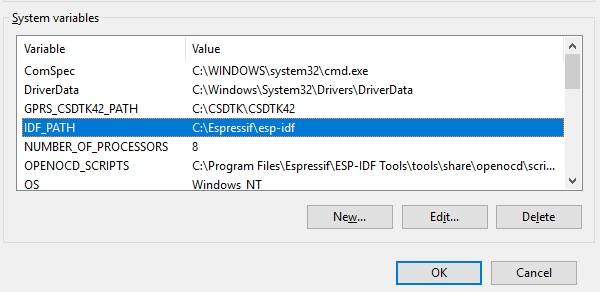  
- go to `Path` variable and click Edit  

    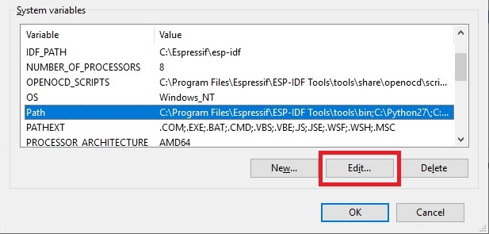  
- Add a new value: `%IDF_PATH%\tools`   

    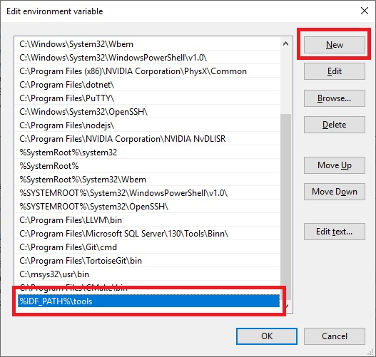   

4. Install https://dl.espressif.com/dl/esp-idf-tools-setup-1.2.exe 
to get the cmake, ninja build, openocd and all other tools needed to build, flash and debug the esp32 

## Get the IDE ##
1. Install Visual Studio code from https://code.visualstudio.com/docs/?dv=win
2. Install C/C++ Intellisense, VsCode Action Buttons and Native Debug extension on VsCode

 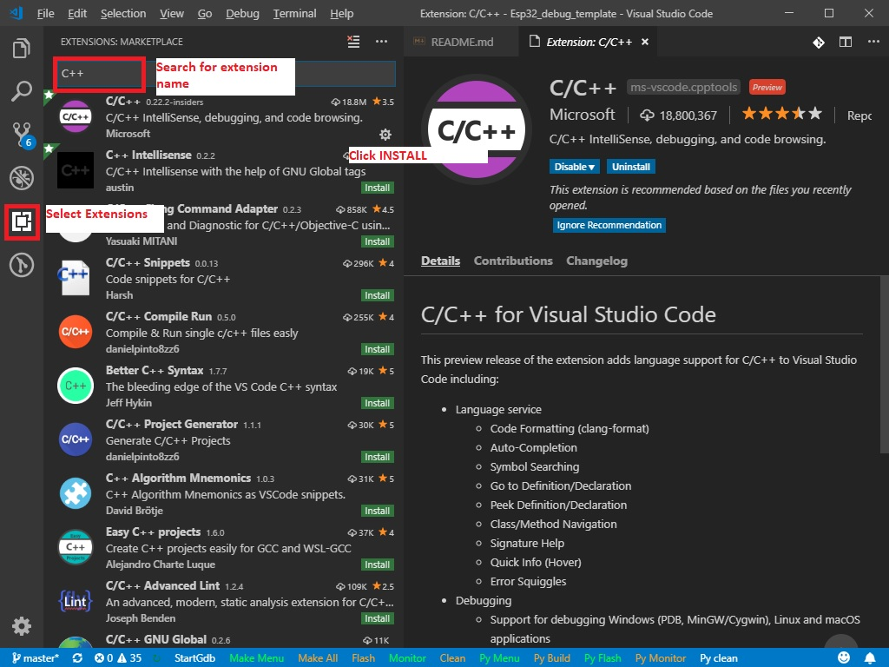

## Set the drivers ##
1. Connect the Wrover Kit (or some other ft2232 debugger) o PC USB
2. Install the FTDI drivers from https://www.ftdichip.com/Drivers/VCP.htm

 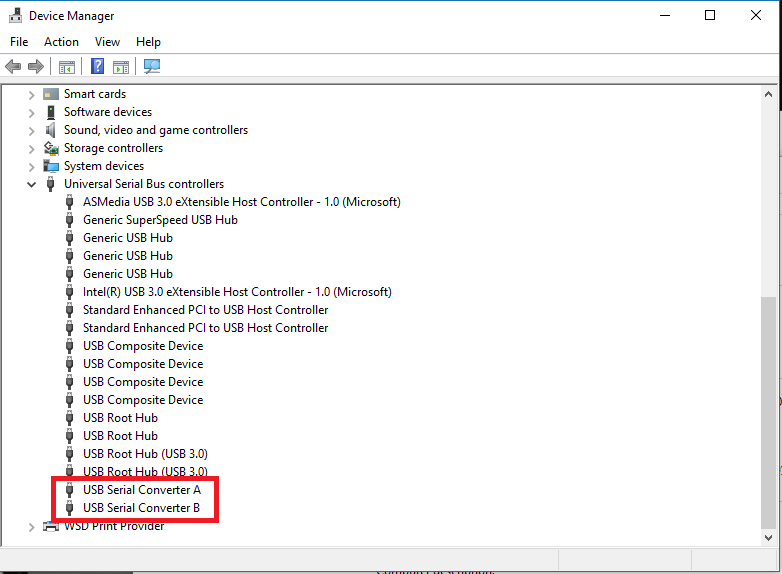

3. Download Zadig tool from https://zadig.akeo.ie/
4. Open Zadig Tool and go to Options->List All Devices

 
5. Select the FT2232 channel you want to use as Jtag.
In case of Wrover-Kit, is channel 0: “Dual RS232-HS (interface 0)”, according to Wrover-Kit schematic:

 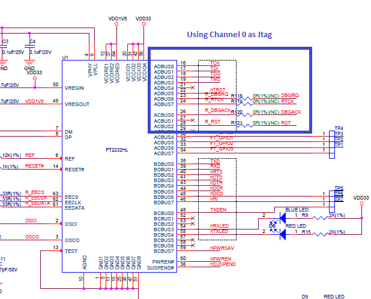

6. Select WinUSB -> Click Replace Driver  

 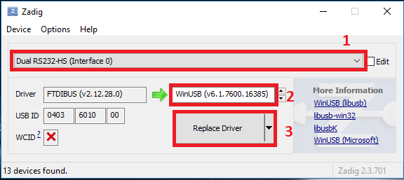
7. After operation completed, disconnect and reconnect the device to USB port
8. In case that other channel (channel 1 in case of wrover-kit) is not detected as com port (used by esptool for flashing),
you must enable the VCP mode on channel 1, this way:
- On device manager, right click on “USB Serial Converter B” - >Properties ->Advanced
Select “Load VCP” then click OK.

 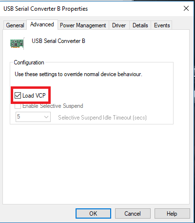

## Open the project, build, debug ##

1. Open this project in VsCode: Right click on the project folder->Open with Code

 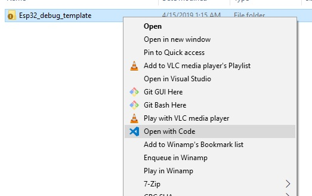
2. If you installed the VsCode extensions properly, you should see the command buttons on the lower bar:

 
- You can use Py Build to build the project using Cmake
- After build, you can flash the project to target using Py Flash command
3. Happy Debugging:

 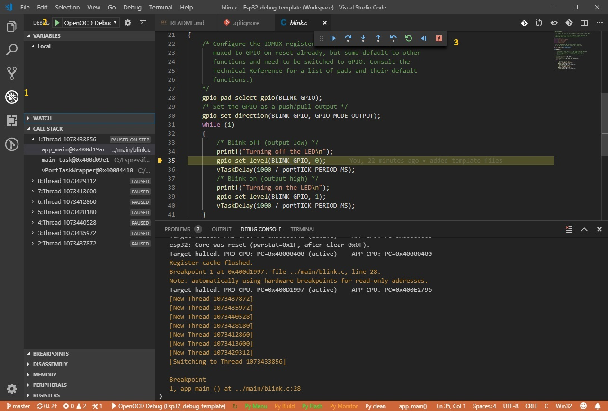