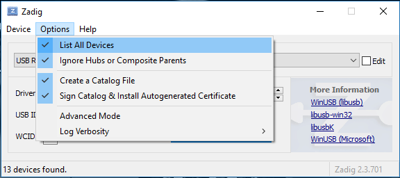

# Esp32_debug_template
A template project for debugginf esp-idf projects on VsCode

## Get the tools ##
1. Install git from https://git-scm.com/download/win
2. Clone the esp-idf v3.2 branch using command:  
 `git clone --recursive -b release/v3.2 https://github.com/espressif/esp-idf.git`
3. Add IDF_PATH and path to esp-idf\tools to system "path" environment variables 
(see https://docs.espressif.com/projects/esp-idf/en/stable/get-started-cmake/add-idf_path-to-profile.html#add-paths-to-profile-windows-cmake )
4. Install https://dl.espressif.com/dl/esp-idf-tools-setup-1.2.exe 
to get the cmake, ninja build, openocd and all other tools needed to build, flash and debug the esp32 
## Get the IDE ##
5. Install Visual Studio code from https://code.visualstudio.com/docs/?dv=win
6. Install C/C++ Intellisense, VsCode Action Buttons and Native Debug extension on VsCode

## Set the drivers ##
7. Connect the Wrover Kit (or some other ft2232 debugger) o PC USB
8. Install the FTDI drivers from https://www.ftdichip.com/Drivers/VCP.htm

9. Download Zadig tool from https://zadig.akeo.ie/
10. Open Zadig Tool and go to Options->List All Devices

11. Select the FT2232 channel you want to use as Jtag.
In case of Wrover-Kit, is channel 0: “Dual RS232-HS (interface 0)”, according to Wrover-Kit schematic:

12. Select WinUSB -> Click Replace Driver

13. After operation completed, disconnect and reconnect the device to USB port
14. In case that other channel (channel 1 in case of wrover-kit) is not detected as com port (used by esptool for flashing),
you must enable the VCP mode on channel 1, this way:
- On device manager, right click on “USB Serial Converter B” - >Properties ->Advanced
Select “Load VCP” then click OK.

## Open the project ##

